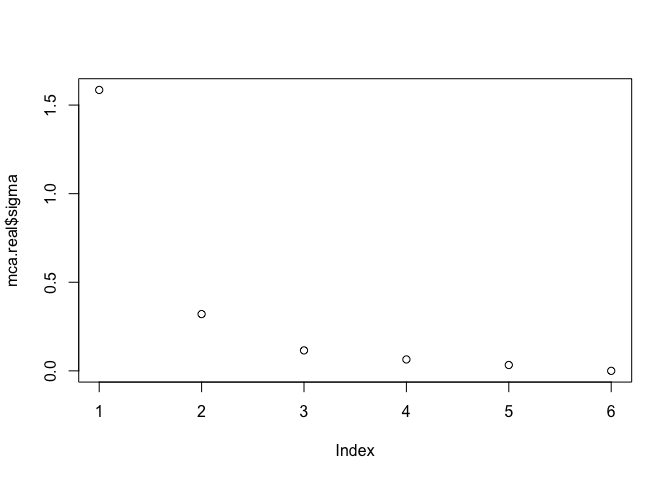
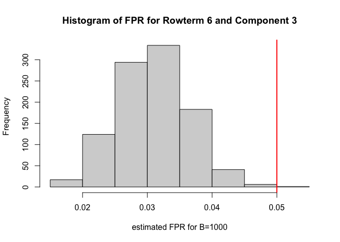

<!-- README.md is generated from README.Rmd. Please edit that file -->

# PMCA

<!-- badges: start -->
<!-- badges: end -->

Permutation-based Maximum Covariance Analysis (PMCA) identifies common
patterns in coupled datasets. To avoid the identification of spurious
patterns, a chief criticism of Maximum Covariance Analysis, PMCA
provides a permutation-based False Positive Rate (FPR) for each
association. This FPR allows for ranking or filtering the results that
fall below a given FPR tolerance.

## Installation

You can install the released version of PMCA from
[github](https://github.com/robyn-ball/PMCA) with:

``` r
library(devtools)
```

If only using the PMCA statistical tool:
`devtools::install_github("robyn-ball/PMCA")`

Or, if using the visualization tool also:

``` r
devtools::install_github("robyn-ball/PMCA@visualization")
```

### Pip

Make sure you have Python \>= 3.6 installed:

``` shell
python3 --version
```

Check if you have pip installed with

``` shell
pip --version
```

If not, or you want to update to the latest version, enter

``` shell
python3 -m pip install --user --upgrade pip
```

### Virtual environment

Check if you have virtualenv installed:

``` shell
virtualenv --version
```

If you don’t already have virtualenv installed:
`python3 -m pip install --user virtualenv`

#### Create the virtual environment:

On MacOS/Unix:

``` shell
python3 -m venv ~/.virtualenvs/iggi
```

On Windows:

``` shell
py -m venv iggi
```

#### Activate the virtual environment:

On MacOS/Unix:

``` shell
source iggi/bin/activate
```

On Windows:

``` shell
iggi\Scripts\activate
```

#### Install the requirements

*Make sure you’re in the pmca-bipartite folder!*

On MacOS/Unix:

``` shell
python3 -m pip install -r requirements.txt
```

On Windows:

``` shell
py -m pip install -r requirements.txt
```

### R & RStudio

If you don’t already have R and RStudio installed:

- [Download and install R](https://cran.rstudio.com/)
- [Download and install
  RStudio](https://posit.co/download/rstudio-desktop/)

## Example

This example uses a subset of the data outlined in the
[manuscript](https://bmcgenomics.biomedcentral.com/articles/10.1186/s12864-016-2865-1).

The full dataset is available at GEO,
[GSE72833](https://www.ncbi.nlm.nih.gov/geo/query/acc.cgi?acc=GSE72833).

Xexample (6 x 28) are the six substage proportions for each mouse (28
mice).

Yexample (1000 x 28) are the corresponding gene expression values (1000
genes) for each mouse (28 mice). Note that for simplicity, Yexample is
only a subset of the gene expression data.

We wish to identify the substage-specific genes, i.e., we wish to map
the genes of Yexample onto the substages of X.

``` r
library(PMCA)
mca.real <- get.mca(Xexample,Yexample)
```

Calculate Z_x, Z_y, and sigma for matrices Xexample and Yexample.

Next, plot the singular values of the covariance matrix of Xexample and
Yexample.

``` r
plot(mca.real$sigma)
```



Now we make some decisions based on the singular values.

The following parameters are + by: by which component do you want the
FPR \<= alpha + alpha: specify alpha such that the FPR \<= alpha by the
given component (by) + method: “overall” to calculate an overall FPR
across the entire component, “each” if you want a FPR for each rowterm
of Xexample. Note that “overall” is faster. + B: number of
permutations + plot: TRUE will plot one of the FPR distributions across
all B permutations.

The following will calculate an FPR for each rowterm of Xexample
(substage) and ensure that the FPR is \<= 0.05 by the 3rd component. It
use 1000 permutations to calculate the FPR and plot a histogram of the
FPR distribution for the 3rd component.

``` r
by<- 3; method <- "each"; B <- 1000; alpha <- 0.05; plot <- TRUE
```

To determine the degree of similarity of patterns, we calculate the
distance between each element of Xexample and each element of Yexample
across all components.

To avoid identifying spurious patterns, we use permutations to estimate
the FPR for each of the associations.

For each of the B permutations, we break the relationship between
Xexample and Yexample by independently shuffling the columns of Xexample
-\> Xstar and calculate the distance between the elements of Xstar and
Yexample. Thus, for every element of Xexample and Yexample, we compare
the observed distance (relative similarity) to B distances where the
relationship between Xexample and Yexample was broken.

These permutation-based distances provide the basis for estimating the
FPR.

First, calculate the observed distances

``` r
scores.real <- get.scores(mca.real$Zx,mca.real$Zy)
scores.neg <- get.scores(-mca.real$Zx,mca.real$Zy) #for anti-associated lists
```

Note, that we can also find patterns that are anti-associated
(scores.neg). For example, it is useful to know the genes that have
decreasing expression as a substage proportion is increasing, and vice
versa.

``` r
set.seed(B) # for reproducibility
scores.rand <- permutation.proc(Xexample,Yexample,method=method,B=B) # get scores for all B permutations
```

Now use the permutation-based scores to identify the optimal window
width and thus ensure that the FPR \<= 0.05 by the 3rd component (as we
specified above).

tau controls the width of the window w/tau. We start with w = the
standard deviation of Z_x and tau=1. Note that a larger tau will be more
strict and result in finer lists of associations. Try a larger or
smaller tau if the lists are too stringent (fine) or too relaxed
(large).

``` r
w <- apply(mca.real$Zx,2,sd) # get starting window vector
set.seed(B) # for reproducibilty
it.result <- iterative.proc(scores.rand,alpha=alpha,w=w,method=method,by=by,rowterms=rownames(Yexample), plot=plot,tau=1)
```



Print tau and the estimated FPR at each component and row of Xexample.

``` r
it.result$tau
#> [1] 1.9
it.result$FPR
#>          [,1]     [,2]     [,3]     [,4]     [,5]
#> [1,] 0.341371 0.132415 0.047533 0.012241 0.002643
#> [2,] 0.397579 0.095322 0.015693 0.002542 0.000295
#> [3,] 0.397601 0.115143 0.024542 0.004695 0.000685
#> [4,] 0.343955 0.133472 0.048512 0.009684 0.001905
#> [5,] 0.341421 0.137083 0.048415 0.011889 0.001733
#> [6,] 0.389366 0.093160 0.031470 0.006232 0.001067
```

The way to read the FPR is that for row 1, the FPR for column 3 is 0.047
and for column 4, the FPR is 0.012.

You will get a finer list as you use more columns so that the genes that
map if you use columns 1-3 have a FPR \<= 0.05 and the genes that map to
a rowterm of Xexample using the 4th component will have a lower FPR.

g = list of rownames(Yexample) that match patterns of rownames(Xexample)

``` r
g <- match.patterns(scores.real,w=it.result$wopt, rowterms = rownames(Yexample))  
```

g\[\[i\]\]\[\[j\]\]: all the rownames(Yexample) that match the pattern
of rownames(Xexample)\[i\] when the component = j

For example, if you want to know what genes map to “LP_Dip” (row 6) when
using 4 components, use g\[\[6\]\]\[\[4\]\].

- g\[\[1\]\]\[\[4\]\] are those genes that match celltype 1 and have a
  FPR \< 0.05
- g\[\[1\]\]\[\[5\]\] are those genes that match celltype 1 and have a
  FPR \< 0.02

Note that necessarily, every gene in g\[\[1\]\]\[\[5\]\] is also in
g\[\[1\]\]\[\[4\]\], g\[\[1\]\]\[\[3\]\], g\[\[1\]\]\[\[2\]\],
g\[\[1\]\]\[\[1\]\].

To see the number of rowterms of Yexample (genes) that map to the
rowterms of Xexample (substages) and the intersections of these lists,
use get.inter().

``` r
int <- get.inter(g,2)
rownames(int) <- colnames(int) <- rownames(Xexample)
int
#>                 Spermatogonia preleptotene Early.leptotene LL_Zyg
#> Spermatogonia              58            0               0      0
#> preleptotene                0           71               0      1
#> Early.leptotene             0            0             303      0
#> LL_Zyg                      0            1               0     93
#> Early.pachytene             0            0               0     55
#> LP_Dip                      0            0               0      0
#>                 Early.pachytene LP_Dip
#> Spermatogonia                 0      0
#> preleptotene                  0      0
#> Early.leptotene               0      0
#> LL_Zyg                       55      0
#> Early.pachytene             134      0
#> LP_Dip                        0    162
```

int\[i,j\] = number of rownames(Yexample) (genes) that mapped to both
rownames(Xexample)\[i\] \[substage i\] & rownames(Xexample)\[j\]
\[substage j\]

Here, we see that 58 genes are specific to Spermatogonia, 162 genes are
specific to LP_Dip, and 55 genes are shared between LL_Zyg and EP.

Using a more stringent FPR, select component 3:

``` r
int <- get.inter(g,3)
rownames(int) <- colnames(int) <- rownames(Xexample)
int
#>                 Spermatogonia preleptotene Early.leptotene LL_Zyg
#> Spermatogonia              44            0               0      0
#> preleptotene                0            5               0      0
#> Early.leptotene             0            0               7      0
#> LL_Zyg                      0            0               0     70
#> Early.pachytene             0            0               0     40
#> LP_Dip                      0            0               0      0
#>                 Early.pachytene LP_Dip
#> Spermatogonia                 0      0
#> preleptotene                  0      0
#> Early.leptotene               0      0
#> LL_Zyg                       40      0
#> Early.pachytene             115      0
#> LP_Dip                        0    154
```

Now, only 44 genes are specific to Spermatogonia and 40 genes are shared
between LL_Zyg and EP

Similarly, the anti-associations can be extracted using scores.neg.

``` r
h <- match.patterns(scores.neg,w=it.result$wopt, rowterms = rownames(Yexample))  
int <- get.inter(h,2)
rownames(int) <- colnames(int) <- rownames(Xexample)
int
#>                 Spermatogonia preleptotene Early.leptotene LL_Zyg
#> Spermatogonia             100            0               0      0
#> preleptotene                0            6               0      1
#> Early.leptotene             0            0             216      0
#> LL_Zyg                      0            1               0     52
#> Early.pachytene             0            0               0     44
#> LP_Dip                      0            0               0      0
#>                 Early.pachytene LP_Dip
#> Spermatogonia                 0      0
#> preleptotene                  0      0
#> Early.leptotene               0      0
#> LL_Zyg                       44      0
#> Early.pachytene             151      0
#> LP_Dip                        0    230
```

Now, we see that 100 genes are anti-associated to spermatogonia, etc.

We extract a dataframe of these associations and anti-associations, as
follows

``` r
mapped.results <- extract.fpr.table(Xexample, Yexample, it.result)
# associated FPRs: FPRs for each rowterm of X and the rowterms of Y that are associated with any rowterm of X
head(mapped.results$assoc.fpr.table[, 1:10])
#>                 NONMMUG008290 ENSMUSG00000061787 ENSMUSG00000059363
#> Spermatogonia        0.002643           0.002643           0.002643
#> preleptotene               NA                 NA                 NA
#> Early.leptotene            NA                 NA                 NA
#> LL_Zyg                     NA                 NA                 NA
#> Early.pachytene            NA                 NA                 NA
#> LP_Dip                     NA                 NA                 NA
#>                 ENSMUSG00000093594 ENSMUSG00000043165 NONMMUG037495
#> Spermatogonia             0.002643           0.002643      0.002643
#> preleptotene                    NA                 NA            NA
#> Early.leptotene                 NA                 NA            NA
#> LL_Zyg                          NA                 NA            NA
#> Early.pachytene                 NA                 NA            NA
#> LP_Dip                          NA                 NA            NA
#>                 ENSMUSG00000035413 ENSMUSG00000003573 ENSMUSG00000082079
#> Spermatogonia             0.002643           0.002643                 NA
#> preleptotene                    NA                 NA                 NA
#> Early.leptotene                 NA                 NA                 NA
#> LL_Zyg                          NA                 NA           0.001905
#> Early.pachytene                 NA                 NA                 NA
#> LP_Dip                          NA                 NA                 NA
#>                 ENSMUSG00000081486
#> Spermatogonia                   NA
#> preleptotene                    NA
#> Early.leptotene                 NA
#> LL_Zyg                    0.001905
#> Early.pachytene                 NA
#> LP_Dip                          NA
# anti-associated FPRs: FPRs for each rowterm of X and the rowterms of Y that are anti-associated with any rowterm of X
head(mapped.results$antiassoc.fpr.table[, 1:10])
#>                 ENSMUSG00000057000 ENSMUSG00000040532 ENSMUSG00000040549
#> Spermatogonia             0.002643           0.002643           0.002643
#> preleptotene                    NA                 NA                 NA
#> Early.leptotene                 NA                 NA                 NA
#> LL_Zyg                          NA                 NA                 NA
#> Early.pachytene                 NA                 NA                 NA
#> LP_Dip                          NA                 NA                 NA
#>                 ENSMUSG00000026816 ENSMUSG00000032537 ENSMUSG00000026021
#> Spermatogonia             0.002643           0.002643           0.002643
#> preleptotene                    NA                 NA                 NA
#> Early.leptotene                 NA                 NA                 NA
#> LL_Zyg                          NA                 NA                 NA
#> Early.pachytene                 NA                 NA                 NA
#> LP_Dip                          NA                 NA                 NA
#>                 NONMMUG023671 ENSMUSG00000037997 ENSMUSG00000038126
#> Spermatogonia        0.002643           0.002643           0.002643
#> preleptotene               NA                 NA                 NA
#> Early.leptotene            NA                 NA                 NA
#> LL_Zyg                     NA                 NA                 NA
#> Early.pachytene            NA                 NA                 NA
#> LP_Dip                     NA                 NA                 NA
#>                 NONMMUG041920
#> Spermatogonia              NA
#> preleptotene               NA
#> Early.leptotene      0.000685
#> LL_Zyg                     NA
#> Early.pachytene            NA
#> LP_Dip                     NA
```

We save the result so we can access it later:

``` r
folder_name <- "results"

if (!file.exists(folder_name)) {
  dir.create(folder_name)
}
for (item_name in names(mapped.results)) {
  file_name <- file.path(folder_name, paste0(item_name, ".csv"))
  write.csv(mapped.results[[item_name]], file = file_name)
}
```

A detailed description of the mathematics behind PMCA can be found
[here](https://static-content.springer.com/esm/art%3A10.1186%2Fs12864-016-2865-1/MediaObjects/12864_2016_2865_MOESM3_ESM.pdf).

## Visualization

Use the directions in `Visualization_README.Rmd` to import the saved
results and generate the k-partite graph.
