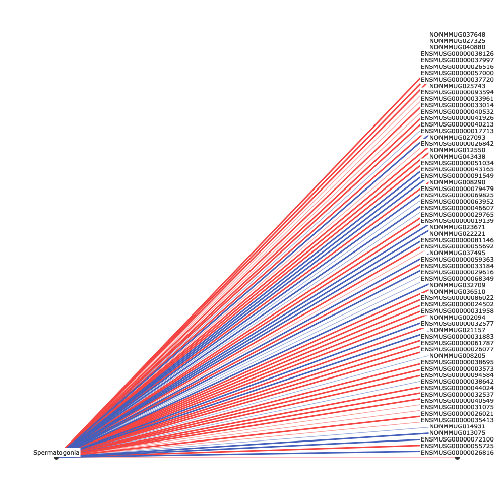

<!-- Visualization_README.md is generated from Visualization_README.Rmd. Please edit that file -->

```{r, include = FALSE}
knitr::opts_chunk$set(
  collapse = TRUE,
  comment = "#>",
  fig.path = "man/figures/Visualization_README-",
  out.width = "100%"
)
```

# Visualization Addition

The following describes the addition of the visualization tool, which also allows export of alternate data structures based on filtering thresholds and k-partite associations.

## Installation

You can install the released version of PMCA from [github](https://github.com/robyn-ball/PMCA) with:

```{r, results = FALSE, message=FALSE}
library(devtools)
devtools::install_github("robyn-ball/PMCA@visualization", force=TRUE)
library(PMCA)
```

## Setup

First, we set up the visualization environment by importing necessary packages and libraries

```{r, results = FALSE, message=FALSE}
library(reticulate) # We use reticulate to run Python functions in R
library(plotly) # Plotly is the visualization tool

# Set up the Python virtual environment
reticulate::use_virtualenv("iggi")

# Load the Python module with reticulate
kp <- import("kpartite")
```

## Quick Start

All of the functionality below has been wrapped in `make.graph.R` for simplicity when generating FPR tables using the `extract.fpr.table` function. It expects, as minimum input, 1) a list of doubles containing the FPRs for the desired data, such as `mapped.results`, 2) `focus`, a string for the column of interest, and 3) a FPR `default_threshold` value as a float. 

There are additional optional parameters, such as the boolean `debug` flag and `apply_threshold` described later in the section "Load Data".

```{r}
# This function requires mapped.results from the main PMCA code, which we import:
dataframe.datalist <- kp$find_data('results', default_threshold=0.01) 
fig <- make.graph(dataframe.datalist, 'Spermatogonia', 0.01, debug=FALSE) # These are the minimum required parameters
```

Display the graph:

```{r interactive_plot, echo = FALSE}
# If markdown viewer supports html:
if (knitr::is_html_output()) {
  fig
}
```

```{r static_image, echo = FALSE, out.width="50%"}
# If markdown viewer does not support html (e.g. GitHub)
if (!knitr::is_html_output()) {
  htmlwidgets::saveWidget(widget = fig, file = "graph.html")
  webshot::webshot(url = "graph.html", file = "graph.png")
  
}
```

All of the code below provides additional functionality, e.g. the ability to load associations from other locations or export various data structures used to make the graphs.

## Load data (optional)

This step is designed for importing .csv files from a directory. Given a k-partite graph with layers I, J, K, this would expect a directory with .csv files in the shapes of I x J and J x K, with some measure (e.g., FPR) computed between features.

If different layers have different connectivity strengths, users can specify substrings to search file names and assign thresholds accordingly (e.g. `'i_vs_j_anti-association.csv'` and `'i_vs_j_association.csv'` could both have their threshold set to `0.05` by adding the key, value pair `'i_vs_j': 0.05` to the `apply_threshold` parameter.)

This will return data in the structure:
`[ { 'name' : <filename>, 'value': <threshold>, 'dataframe': <dataframe> }, { ... }, { ... }, ... ]`
such that there is a list of length K which contains metadata and dataframes for each loaded dataset.

```{r}
# Specify a data directory
directory <- 'results'

# Import the data and, optionally, set custom thresholds
dataframe.datalist <- kp$find_data(directory,
  apply_threshold=list( # (Optional): Specify thresholds for files containing certain substrings
    'anti' = 0.03),
  default_threshold=0.02 # Set a default threshold for everything not specified
) 

# This returns a list of dicts where dataframe_datalist[n]['dataframe'] are the n dataframes
dataframe.datalist
```

## Extract edgelists

This function computes edgelists for each of the dataframes in dataframe.datalist. 

Obtain a list of edgelists from the dataframe list; specify node of interest:

```{r}
edgelist.datalist <- kp$get_edgelists(dataframe.datalist, 'Spermatogonia')
edgelist.datalist
```
Obtain a list of nodes from the set of edgelists:

```{r}
nodelist <- kp$get_nodes(edgelist.datalist)
nodelist
```

Concatenate all the edgelists together and position the edges/nodes:

```{r}
positioned.edges <- kp$get_edge_positions(edgelist.datalist, nodelist)
positioned.edges
```

Plot the visualization:

```{r}
fig <- make.graph(dataframe.datalist, 'Spermatogonia', 0.01, debug=TRUE)
```

```{r interactive_plot_2, echo = FALSE}
# If markdown viewer supports html:
if (knitr::is_html_output()) {
  fig
}
```

```{r static_image_2, echo = FALSE, out.width="50%"}
# If markdown viewer does not support html (e.g. GitHub)
if (!knitr::is_html_output()) {
  htmlwidgets::saveWidget(widget = fig, file = "graph.html")
  webshot::webshot(url = "graph.html", file = "graph.png")
  
}
```
