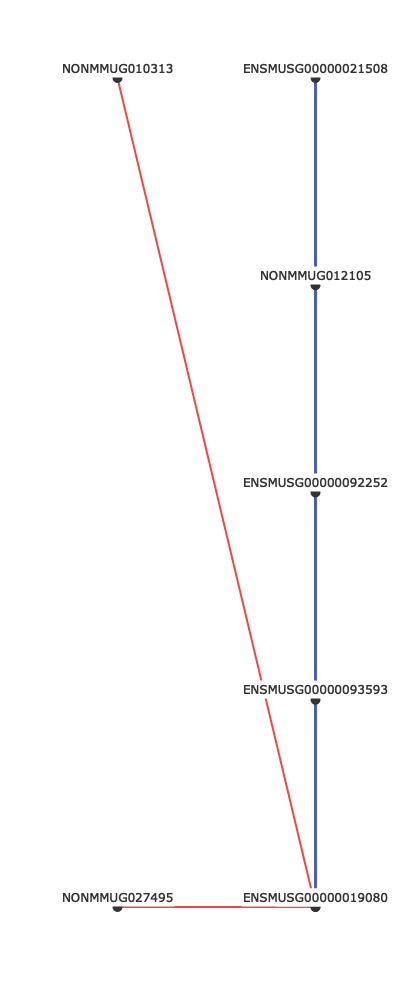

<!-- Visualization_README.md is generated from Visualization_README.Rmd. Please edit that file -->

# Visualization Addition

The following describes the addition of the visualization tool, which
also allows export of alternate data structures based on filtering
thresholds and k-partite associations.

## Installation

You can install the released version of PMCA from
[github](https://github.com/robyn-ball/PMCA) with:

``` r
library(devtools)
devtools::install_github("robyn-ball/PMCA@visualization", force=TRUE)
library(PMCA)
```

## Setup

First, we set up the visualization environment by importing necessary
packages and libraries

``` r
library(reticulate) # We use reticulate to run Python functions in R
library(plotly) # Plotly is the visualization tool
#> Loading required package: ggplot2
#> 
#> Attaching package: 'plotly'
#> The following object is masked from 'package:ggplot2':
#> 
#>     last_plot
#> The following object is masked from 'package:stats':
#> 
#>     filter
#> The following object is masked from 'package:graphics':
#> 
#>     layout

# Set up the Python virtual environment
reticulate::use_virtualenv("iggi")

# Load the Python module with reticulate
kp <- import("kpartite")
```

## Quick Start

All of the functionality below has been wrapped in `make.graph.R` for
simplicity when generating FPR tables using the `extract.fpr.table`
function. It expects, as minimum input, 1) a list of doubles containing
the FPRs for the desired data, such as `mapped.results`, 2) `focus`, a
string for the column of interest, and 3) a FPR `default_threshold`
value as a float.

There are additional optional parameters, such as the boolean `debug`
flag and `apply_threshold` described later in the section “Load Data”.

``` r
# This function requires mapped.results from the main PMCA code, which we import:
dataframe.datalist <- kp$find_data('results', default_threshold=0.01) 
fig <- make.graph(dataframe.datalist, 'Spermatogonia', 0.01, debug=FALSE) # These are the minimum required parameters
```

Display the graph:


All of the code below provides additional functionality, e.g. the
ability to load associations from other locations or export various data
structures used to make the graphs.

## Load data (optional)

This step is designed for importing .csv files from a directory. Given a
k-partite graph with layers I, J, K, this would expect a directory with
.csv files in the shapes of I x J and J x K, with some measure (e.g.,
FPR) computed between features.

If different layers have different connectivity strengths, users can
specify substrings to search file names and assign thresholds
accordingly (e.g. `'i_vs_j_anti-association.csv'` and
`'i_vs_j_association.csv'` could both have their threshold set to `0.05`
by adding the key, value pair `'i_vs_j': 0.05` to the `apply_threshold`
parameter.)

This will return data in the structure:
`[ { 'name' : <filename>, 'value': <threshold>, 'dataframe': <dataframe> }, { ... }, { ... }, ... ]`
such that there is a list of length K which contains metadata and
dataframes for each loaded dataset.

``` r
# Specify a data directory
directory <- 'results'

# Import the data and, optionally, set custom thresholds
dataframe.datalist <- kp$find_data(directory,
  apply_threshold=list( # (Optional): Specify thresholds for files containing certain substrings
    'anti' = 0.03),
  default_threshold=0.02 # Set a default threshold for everything not specified
) 

# This returns a list of dicts where dataframe_datalist[n]['dataframe'] are the n dataframes
dataframe.datalist
#> [[1]]
#> [[1]]$name
#> [1] "antiassoc.fpr.table.csv"
#> 
#> [[1]]$anti
#> [1] TRUE
#> 
#> [[1]]$threshold
#> [1] 0.03
#> 
#> [[1]]$dataframe
#>                  ENSMUSG00000057000  ...  NONMMUG034295
#> Spermatogonia              0.002643  ...            NaN
#> preleptotene                    NaN  ...            NaN
#> Early.leptotene                 NaN  ...            NaN
#> LL_Zyg                          NaN  ...            NaN
#> Early.pachytene                 NaN  ...            NaN
#> LP_Dip                          NaN  ...        0.09316
#> 
#> [6 rows x 710 columns]
#> 
#> 
#> [[2]]
#> [[2]]$name
#> [1] "assoc.fpr.table.csv"
#> 
#> [[2]]$anti
#> [1] FALSE
#> 
#> [[2]]$threshold
#> [1] 0.02
#> 
#> [[2]]$dataframe
#>                  NONMMUG008290  ...  NONMMUG034208
#> Spermatogonia         0.002643  ...            NaN
#> preleptotene               NaN  ...            NaN
#> Early.leptotene            NaN  ...            NaN
#> LL_Zyg                     NaN  ...            NaN
#> Early.pachytene            NaN  ...            NaN
#> LP_Dip                     NaN  ...        0.09316
#> 
#> [6 rows x 765 columns]
```

## Extract edgelists

This function computes edgelists for each of the dataframes in
dataframe.datalist.

Obtain a list of edgelists from the dataframe list; specifiy node of
interest:

``` r
edgelist.datalist <- kp$get_edgelists(dataframe.datalist, 'preleptotene')
edgelist.datalist
#> [[1]]
#> [[1]]$name
#> [1] "antiassoc.fpr.table.csv"
#> 
#> [[1]]$selected
#> [1] "preleptotene"
#> 
#> [[1]]$value
#> [1] 0.03
#> 
#> [[1]]$anti
#> [1] TRUE
#> 
#> [[1]]$dataframe
#>           source        target  ...  direct  weight
#> 0  NONMMUG010313  preleptotene  ...    True     NaN
#> 1  NONMMUG027495  preleptotene  ...    True     NaN
#> 
#> [2 rows x 7 columns]
#> 
#> 
#> [[2]]
#> [[2]]$name
#> [1] "assoc.fpr.table.csv"
#> 
#> [[2]]$selected
#> [1] "preleptotene"
#> 
#> [[2]]$value
#> [1] 0.02
#> 
#> [[2]]$anti
#> [1] FALSE
#> 
#> [[2]]$dataframe
#>                source        target  ...  direct  weight
#> 0  ENSMUSG00000093593  preleptotene  ...    True     0.5
#> 1       NONMMUG012105  preleptotene  ...    True     0.5
#> 2  ENSMUSG00000092252  preleptotene  ...    True     0.5
#> 3  ENSMUSG00000019080  preleptotene  ...    True     1.0
#> 4  ENSMUSG00000021508  preleptotene  ...    True     1.0
#> 
#> [5 rows x 7 columns]
```

Obtain a list of nodes from the set of edgelists:

``` r
nodelist <- kp$get_nodes(edgelist.datalist)
nodelist
#>   layer               node        x    y
#> 1     0      NONMMUG027495   0.0000    0
#> 2     0      NONMMUG010313   0.0000 1000
#> 3     2       preleptotene 666.6667    0
#> 4     2 ENSMUSG00000019080 666.6667    0
#> 5     2 ENSMUSG00000093593 666.6667  250
#> 6     2 ENSMUSG00000092252 666.6667  500
#> 7     2      NONMMUG012105 666.6667  750
#> 8     2 ENSMUSG00000021508 666.6667 1000
```

Concatenate all the edgelists together and position the edges/nodes:

``` r
positioned.edges <- kp$get_edge_positions(edgelist.datalist, nodelist)
positioned.edges
#>               source       target    value  anti              provenance direct
#> 1      NONMMUG010313 preleptotene 0.002542  TRUE antiassoc.fpr.table.csv   TRUE
#> 2      NONMMUG027495 preleptotene 0.002542  TRUE antiassoc.fpr.table.csv   TRUE
#> 3 ENSMUSG00000093593 preleptotene 0.002542 FALSE     assoc.fpr.table.csv   TRUE
#> 4      NONMMUG012105 preleptotene 0.002542 FALSE     assoc.fpr.table.csv   TRUE
#> 5 ENSMUSG00000092252 preleptotene 0.002542 FALSE     assoc.fpr.table.csv   TRUE
#> 6 ENSMUSG00000019080 preleptotene 0.015693 FALSE     assoc.fpr.table.csv   TRUE
#> 7 ENSMUSG00000021508 preleptotene 0.015693 FALSE     assoc.fpr.table.csv   TRUE
#>   weight       x1   y1       x2 y2
#> 1    NaN   0.0000 1000 666.6667  0
#> 2    NaN   0.0000    0 666.6667  0
#> 3    0.5 666.6667  250 666.6667  0
#> 4    0.5 666.6667  750 666.6667  0
#> 5    0.5 666.6667  500 666.6667  0
#> 6    1.0 666.6667    0 666.6667  0
#> 7    1.0 666.6667 1000 666.6667  0
```

Plot the visualization:

``` r
fig <- make.graph(dataframe.datalist, 'preleptotene', 0.1, debug=TRUE)
fig
```


