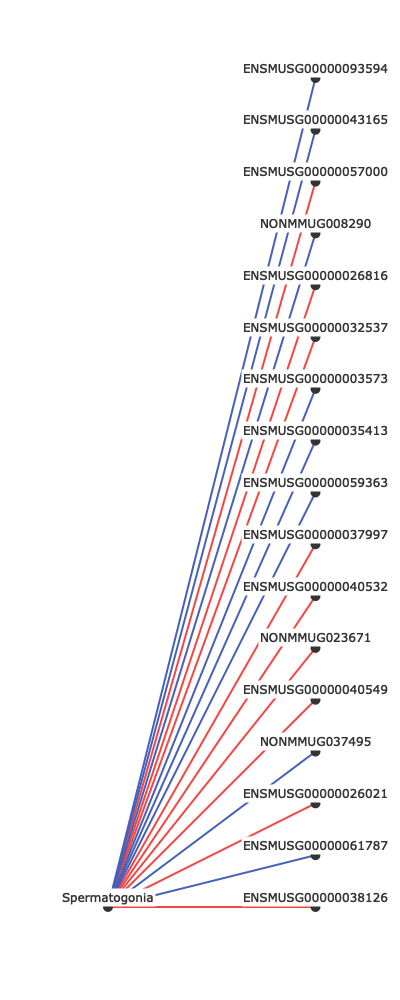
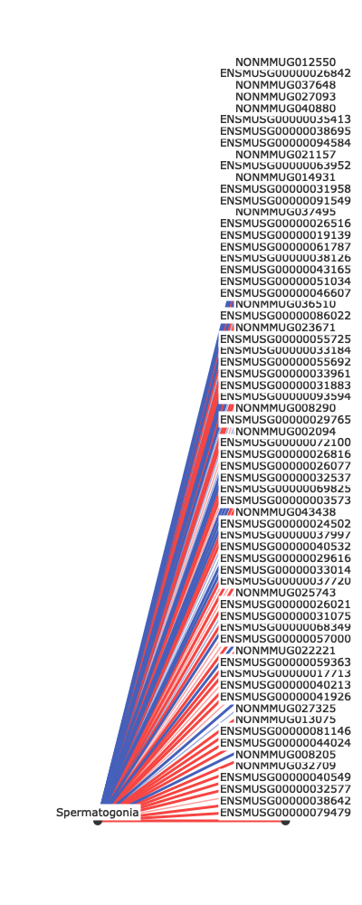

<!-- Visualization_README.md is generated from Visualization_README.Rmd. Please edit that file -->

# Visualization Addition

The following describes the addition of the visualization tool, which
also allows export of alternate data structures based on filtering
thresholds and k-partite associations.

## Installation

You can install the released version of PMCA from
[github](https://github.com/robyn-ball/PMCA) with:

``` r
library(devtools)
devtools::install_github("robyn-ball/PMCA@visualization", force=TRUE)
library(PMCA)
```

## Setup

First, we set up the visualization environment by importing necessary
packages and libraries

``` r
library(reticulate) # We use reticulate to run Python functions in R
library(plotly) # Plotly is the visualization tool

# Set up the Python virtual environment
reticulate::use_virtualenv("iggi")

# Load the Python module with reticulate
kp <- import("kpartite")
```

## Quick Start

All of the functionality below has been wrapped in `make.graph.R` for
simplicity when generating FPR tables using the `extract.fpr.table`
function. It expects, as minimum input, 1) a list of doubles containing
the FPRs for the desired data, such as `mapped.results`, 2) `focus`, a
string for the column of interest, and 3) a FPR `default_threshold`
value as a float.

There are additional optional parameters, such as the boolean `debug`
flag and `apply_threshold` described later in the section “Load Data”.

``` r
# This function requires mapped.results from the main PMCA code, which we import:
dataframe.datalist <- kp$find_data('results', default_threshold=0.01) 
fig <- make.graph(dataframe.datalist, 'Spermatogonia', 0.01, debug=FALSE) # These are the minimum required parameters
```

Display the graph:



All of the code below provides additional functionality, e.g. the
ability to load associations from other locations or export various data
structures used to make the graphs.

## Load data (optional)

This step is designed for importing .csv files from a directory. Given a
k-partite graph with layers I, J, K, this would expect a directory with
.csv files in the shapes of I x J and J x K, with some measure (e.g.,
FPR) computed between features.

If different layers have different connectivity strengths, users can
specify substrings to search file names and assign thresholds
accordingly (e.g. `'i_vs_j_anti-association.csv'` and
`'i_vs_j_association.csv'` could both have their threshold set to `0.05`
by adding the key, value pair `'i_vs_j': 0.05` to the `apply_threshold`
parameter.)

This will return data in the structure:
`[ { 'name' : <filename>, 'value': <threshold>, 'dataframe': <dataframe> }, { ... }, { ... }, ... ]`
such that there is a list of length K which contains metadata and
dataframes for each loaded dataset.

``` r
# Specify a data directory
directory <- 'results'

# Import the data and, optionally, set custom thresholds
dataframe.datalist <- kp$find_data(directory,
  apply_threshold=list( # (Optional): Specify thresholds for files containing certain substrings
    'anti' = 0.03),
  default_threshold=0.02 # Set a default threshold for everything not specified
) 

# This returns a list of dicts where dataframe_datalist[n]['dataframe'] are the n dataframes
dataframe.datalist
#> [[1]]
#> [[1]]$name
#> [1] "antiassoc.fpr.table.csv"
#> 
#> [[1]]$anti
#> [1] TRUE
#> 
#> [[1]]$threshold
#> [1] 0.03
#> 
#> [[1]]$dataframe
#>                  ENSMUSG00000057000  ...  NONMMUG034295
#> Spermatogonia              0.002643  ...            NaN
#> preleptotene                    NaN  ...            NaN
#> Early.leptotene                 NaN  ...            NaN
#> LL_Zyg                          NaN  ...            NaN
#> Early.pachytene                 NaN  ...            NaN
#> LP_Dip                          NaN  ...        0.09316
#> 
#> [6 rows x 710 columns]
#> 
#> 
#> [[2]]
#> [[2]]$name
#> [1] "assoc.fpr.table.csv"
#> 
#> [[2]]$anti
#> [1] FALSE
#> 
#> [[2]]$threshold
#> [1] 0.02
#> 
#> [[2]]$dataframe
#>                  NONMMUG008290  ...  NONMMUG034208
#> Spermatogonia         0.002643  ...            NaN
#> preleptotene               NaN  ...            NaN
#> Early.leptotene            NaN  ...            NaN
#> LL_Zyg                     NaN  ...            NaN
#> Early.pachytene            NaN  ...            NaN
#> LP_Dip                     NaN  ...        0.09316
#> 
#> [6 rows x 765 columns]
```

## Extract edgelists

This function computes edgelists for each of the dataframes in
dataframe.datalist.

Obtain a list of edgelists from the dataframe list; specify node of
interest:

``` r
edgelist.datalist <- kp$get_edgelists(dataframe.datalist, 'Spermatogonia')
edgelist.datalist
#> [[1]]
#> [[1]]$name
#> [1] "antiassoc.fpr.table.csv"
#> 
#> [[1]]$selected
#> [1] "Spermatogonia"
#> 
#> [[1]]$value
#> [1] 0.03
#> 
#> [[1]]$anti
#> [1] TRUE
#> 
#> [[1]]$dataframe
#>                 source         target  ...  direct  weight
#> 0   ENSMUSG00000057000  Spermatogonia  ...    True     0.5
#> 1   ENSMUSG00000040532  Spermatogonia  ...    True     0.5
#> 2   ENSMUSG00000040549  Spermatogonia  ...    True     0.5
#> 3   ENSMUSG00000026816  Spermatogonia  ...    True     0.5
#> 4   ENSMUSG00000032537  Spermatogonia  ...    True     0.5
#> 5   ENSMUSG00000026021  Spermatogonia  ...    True     0.5
#> 6        NONMMUG023671  Spermatogonia  ...    True     0.5
#> 7   ENSMUSG00000037997  Spermatogonia  ...    True     0.5
#> 8   ENSMUSG00000038126  Spermatogonia  ...    True     0.5
#> 9        NONMMUG040880  Spermatogonia  ...    True     1.0
#> 10       NONMMUG037648  Spermatogonia  ...    True     1.0
#> 11  ENSMUSG00000040213  Spermatogonia  ...    True     1.0
#> 12  ENSMUSG00000069825  Spermatogonia  ...    True     1.0
#> 13  ENSMUSG00000031883  Spermatogonia  ...    True     1.0
#> 14       NONMMUG027325  Spermatogonia  ...    True     1.0
#> 15  ENSMUSG00000068349  Spermatogonia  ...    True     1.0
#> 16  ENSMUSG00000026077  Spermatogonia  ...    True     1.0
#> 17  ENSMUSG00000086022  Spermatogonia  ...    True     1.0
#> 18  ENSMUSG00000044024  Spermatogonia  ...    True     1.0
#> 19       NONMMUG032709  Spermatogonia  ...    True     1.0
#> 20  ENSMUSG00000032577  Spermatogonia  ...    True     1.0
#> 21  ENSMUSG00000017713  Spermatogonia  ...    True     1.0
#> 22  ENSMUSG00000037720  Spermatogonia  ...    True     1.0
#> 23  ENSMUSG00000072100  Spermatogonia  ...    True     1.0
#> 24  ENSMUSG00000029616  Spermatogonia  ...    True     1.0
#> 25  ENSMUSG00000019139  Spermatogonia  ...    True     1.0
#> 26       NONMMUG021157  Spermatogonia  ...    True     1.0
#> 27  ENSMUSG00000031958  Spermatogonia  ...    True     1.0
#> 28  ENSMUSG00000081146  Spermatogonia  ...    True     1.0
#> 29  ENSMUSG00000026516  Spermatogonia  ...    True     1.0
#> 30  ENSMUSG00000033961  Spermatogonia  ...    True     1.0
#> 31       NONMMUG008205  Spermatogonia  ...    True     1.0
#> 32  ENSMUSG00000038642  Spermatogonia  ...    True     1.0
#> 33  ENSMUSG00000038695  Spermatogonia  ...    True     1.0
#> 34       NONMMUG043438  Spermatogonia  ...    True     1.0
#> 35       NONMMUG025743  Spermatogonia  ...    True     1.0
#> 36  ENSMUSG00000079479  Spermatogonia  ...    True     1.0
#> 37       NONMMUG036510  Spermatogonia  ...    True     1.0
#> 38  ENSMUSG00000031075  Spermatogonia  ...    True     1.0
#> 39  ENSMUSG00000094584  Spermatogonia  ...    True     1.0
#> 40  ENSMUSG00000041926  Spermatogonia  ...    True     1.0
#> 
#> [41 rows x 7 columns]
#> 
#> 
#> [[2]]
#> [[2]]$name
#> [1] "assoc.fpr.table.csv"
#> 
#> [[2]]$selected
#> [1] "Spermatogonia"
#> 
#> [[2]]$value
#> [1] 0.02
#> 
#> [[2]]$anti
#> [1] FALSE
#> 
#> [[2]]$dataframe
#>                 source         target  ...  direct  weight
#> 0        NONMMUG008290  Spermatogonia  ...    True     0.5
#> 1   ENSMUSG00000061787  Spermatogonia  ...    True     0.5
#> 2   ENSMUSG00000059363  Spermatogonia  ...    True     0.5
#> 3   ENSMUSG00000093594  Spermatogonia  ...    True     0.5
#> 4   ENSMUSG00000043165  Spermatogonia  ...    True     0.5
#> 5        NONMMUG037495  Spermatogonia  ...    True     0.5
#> 6   ENSMUSG00000035413  Spermatogonia  ...    True     0.5
#> 7   ENSMUSG00000003573  Spermatogonia  ...    True     0.5
#> 8        NONMMUG012550  Spermatogonia  ...    True     1.0
#> 9        NONMMUG027093  Spermatogonia  ...    True     1.0
#> 10  ENSMUSG00000024502  Spermatogonia  ...    True     1.0
#> 11  ENSMUSG00000055725  Spermatogonia  ...    True     1.0
#> 12       NONMMUG002094  Spermatogonia  ...    True     1.0
#> 13       NONMMUG013075  Spermatogonia  ...    True     1.0
#> 14  ENSMUSG00000051034  Spermatogonia  ...    True     1.0
#> 15  ENSMUSG00000033014  Spermatogonia  ...    True     1.0
#> 16  ENSMUSG00000091549  Spermatogonia  ...    True     1.0
#> 17  ENSMUSG00000063952  Spermatogonia  ...    True     1.0
#> 18  ENSMUSG00000029765  Spermatogonia  ...    True     1.0
#> 19  ENSMUSG00000055692  Spermatogonia  ...    True     1.0
#> 20       NONMMUG014931  Spermatogonia  ...    True     1.0
#> 21       NONMMUG022221  Spermatogonia  ...    True     1.0
#> 22  ENSMUSG00000026842  Spermatogonia  ...    True     1.0
#> 23  ENSMUSG00000033184  Spermatogonia  ...    True     1.0
#> 24  ENSMUSG00000046607  Spermatogonia  ...    True     1.0
#> 
#> [25 rows x 7 columns]
```

Obtain a list of nodes from the set of edgelists:

``` r
nodelist <- kp$get_nodes(edgelist.datalist)
nodelist
#>    layer               node    x          y
#> 1      0      Spermatogonia    0    0.00000
#> 2      2 ENSMUSG00000079479 1000    0.00000
#> 3      2 ENSMUSG00000038642 1000   15.38462
#> 4      2 ENSMUSG00000032577 1000   30.76923
#> 5      2 ENSMUSG00000040549 1000   46.15385
#> 6      2      NONMMUG032709 1000   61.53846
#> 7      2      NONMMUG008205 1000   76.92308
#> 8      2 ENSMUSG00000044024 1000   92.30769
#> 9      2 ENSMUSG00000081146 1000  107.69231
#> 10     2      NONMMUG013075 1000  123.07692
#> 11     2      NONMMUG027325 1000  138.46154
#> 12     2 ENSMUSG00000041926 1000  153.84615
#> 13     2 ENSMUSG00000040213 1000  169.23077
#> 14     2 ENSMUSG00000017713 1000  184.61538
#> 15     2 ENSMUSG00000059363 1000  200.00000
#> 16     2      NONMMUG022221 1000  215.38462
#> 17     2 ENSMUSG00000057000 1000  230.76923
#> 18     2 ENSMUSG00000068349 1000  246.15385
#> 19     2 ENSMUSG00000031075 1000  261.53846
#> 20     2 ENSMUSG00000026021 1000  276.92308
#> 21     2      NONMMUG025743 1000  292.30769
#> 22     2 ENSMUSG00000037720 1000  307.69231
#> 23     2 ENSMUSG00000033014 1000  323.07692
#> 24     2 ENSMUSG00000029616 1000  338.46154
#> 25     2 ENSMUSG00000040532 1000  353.84615
#> 26     2 ENSMUSG00000037997 1000  369.23077
#> 27     2 ENSMUSG00000024502 1000  384.61538
#> 28     2      NONMMUG043438 1000  400.00000
#> 29     2 ENSMUSG00000003573 1000  415.38462
#> 30     2 ENSMUSG00000069825 1000  430.76923
#> 31     2 ENSMUSG00000032537 1000  446.15385
#> 32     2 ENSMUSG00000026077 1000  461.53846
#> 33     2 ENSMUSG00000026816 1000  476.92308
#> 34     2 ENSMUSG00000072100 1000  492.30769
#> 35     2      NONMMUG002094 1000  507.69231
#> 36     2 ENSMUSG00000029765 1000  523.07692
#> 37     2      NONMMUG008290 1000  538.46154
#> 38     2 ENSMUSG00000093594 1000  553.84615
#> 39     2 ENSMUSG00000031883 1000  569.23077
#> 40     2 ENSMUSG00000033961 1000  584.61538
#> 41     2 ENSMUSG00000055692 1000  600.00000
#> 42     2 ENSMUSG00000033184 1000  615.38462
#> 43     2 ENSMUSG00000055725 1000  630.76923
#> 44     2      NONMMUG023671 1000  646.15385
#> 45     2 ENSMUSG00000086022 1000  661.53846
#> 46     2      NONMMUG036510 1000  676.92308
#> 47     2 ENSMUSG00000046607 1000  692.30769
#> 48     2 ENSMUSG00000051034 1000  707.69231
#> 49     2 ENSMUSG00000043165 1000  723.07692
#> 50     2 ENSMUSG00000038126 1000  738.46154
#> 51     2 ENSMUSG00000061787 1000  753.84615
#> 52     2 ENSMUSG00000019139 1000  769.23077
#> 53     2 ENSMUSG00000026516 1000  784.61538
#> 54     2      NONMMUG037495 1000  800.00000
#> 55     2 ENSMUSG00000091549 1000  815.38462
#> 56     2 ENSMUSG00000031958 1000  830.76923
#> 57     2      NONMMUG014931 1000  846.15385
#> 58     2 ENSMUSG00000063952 1000  861.53846
#> 59     2      NONMMUG021157 1000  876.92308
#> 60     2 ENSMUSG00000094584 1000  892.30769
#> 61     2 ENSMUSG00000038695 1000  907.69231
#> 62     2 ENSMUSG00000035413 1000  923.07692
#> 63     2      NONMMUG040880 1000  938.46154
#> 64     2      NONMMUG027093 1000  953.84615
#> 65     2      NONMMUG037648 1000  969.23077
#> 66     2 ENSMUSG00000026842 1000  984.61538
#> 67     2      NONMMUG012550 1000 1000.00000
```

Concatenate all the edgelists together and position the edges/nodes:

``` r
positioned.edges <- kp$get_edge_positions(edgelist.datalist, nodelist)
positioned.edges
#>                source        target    value  anti              provenance
#> 1  ENSMUSG00000057000 Spermatogonia 0.002643  TRUE antiassoc.fpr.table.csv
#> 2  ENSMUSG00000040532 Spermatogonia 0.002643  TRUE antiassoc.fpr.table.csv
#> 3  ENSMUSG00000040549 Spermatogonia 0.002643  TRUE antiassoc.fpr.table.csv
#> 4  ENSMUSG00000026816 Spermatogonia 0.002643  TRUE antiassoc.fpr.table.csv
#> 5  ENSMUSG00000032537 Spermatogonia 0.002643  TRUE antiassoc.fpr.table.csv
#> 6  ENSMUSG00000026021 Spermatogonia 0.002643  TRUE antiassoc.fpr.table.csv
#> 7       NONMMUG023671 Spermatogonia 0.002643  TRUE antiassoc.fpr.table.csv
#> 8  ENSMUSG00000037997 Spermatogonia 0.002643  TRUE antiassoc.fpr.table.csv
#> 9  ENSMUSG00000038126 Spermatogonia 0.002643  TRUE antiassoc.fpr.table.csv
#> 10      NONMMUG040880 Spermatogonia 0.012241  TRUE antiassoc.fpr.table.csv
#> 11      NONMMUG037648 Spermatogonia 0.012241  TRUE antiassoc.fpr.table.csv
#> 12 ENSMUSG00000040213 Spermatogonia 0.012241  TRUE antiassoc.fpr.table.csv
#> 13 ENSMUSG00000069825 Spermatogonia 0.012241  TRUE antiassoc.fpr.table.csv
#> 14 ENSMUSG00000031883 Spermatogonia 0.012241  TRUE antiassoc.fpr.table.csv
#> 15      NONMMUG027325 Spermatogonia 0.012241  TRUE antiassoc.fpr.table.csv
#> 16 ENSMUSG00000068349 Spermatogonia 0.012241  TRUE antiassoc.fpr.table.csv
#> 17 ENSMUSG00000026077 Spermatogonia 0.012241  TRUE antiassoc.fpr.table.csv
#> 18 ENSMUSG00000086022 Spermatogonia 0.012241  TRUE antiassoc.fpr.table.csv
#> 19 ENSMUSG00000044024 Spermatogonia 0.012241  TRUE antiassoc.fpr.table.csv
#> 20      NONMMUG032709 Spermatogonia 0.012241  TRUE antiassoc.fpr.table.csv
#> 21 ENSMUSG00000032577 Spermatogonia 0.012241  TRUE antiassoc.fpr.table.csv
#> 22 ENSMUSG00000017713 Spermatogonia 0.012241  TRUE antiassoc.fpr.table.csv
#> 23 ENSMUSG00000037720 Spermatogonia 0.012241  TRUE antiassoc.fpr.table.csv
#> 24 ENSMUSG00000072100 Spermatogonia 0.012241  TRUE antiassoc.fpr.table.csv
#> 25 ENSMUSG00000029616 Spermatogonia 0.012241  TRUE antiassoc.fpr.table.csv
#> 26 ENSMUSG00000019139 Spermatogonia 0.012241  TRUE antiassoc.fpr.table.csv
#> 27      NONMMUG021157 Spermatogonia 0.012241  TRUE antiassoc.fpr.table.csv
#> 28 ENSMUSG00000031958 Spermatogonia 0.012241  TRUE antiassoc.fpr.table.csv
#> 29 ENSMUSG00000081146 Spermatogonia 0.012241  TRUE antiassoc.fpr.table.csv
#> 30 ENSMUSG00000026516 Spermatogonia 0.012241  TRUE antiassoc.fpr.table.csv
#> 31 ENSMUSG00000033961 Spermatogonia 0.012241  TRUE antiassoc.fpr.table.csv
#> 32      NONMMUG008205 Spermatogonia 0.012241  TRUE antiassoc.fpr.table.csv
#> 33 ENSMUSG00000038642 Spermatogonia 0.012241  TRUE antiassoc.fpr.table.csv
#> 34 ENSMUSG00000038695 Spermatogonia 0.012241  TRUE antiassoc.fpr.table.csv
#> 35      NONMMUG043438 Spermatogonia 0.012241  TRUE antiassoc.fpr.table.csv
#> 36      NONMMUG025743 Spermatogonia 0.012241  TRUE antiassoc.fpr.table.csv
#> 37 ENSMUSG00000079479 Spermatogonia 0.012241  TRUE antiassoc.fpr.table.csv
#> 38      NONMMUG036510 Spermatogonia 0.012241  TRUE antiassoc.fpr.table.csv
#> 39 ENSMUSG00000031075 Spermatogonia 0.012241  TRUE antiassoc.fpr.table.csv
#> 40 ENSMUSG00000094584 Spermatogonia 0.012241  TRUE antiassoc.fpr.table.csv
#> 41 ENSMUSG00000041926 Spermatogonia 0.012241  TRUE antiassoc.fpr.table.csv
#> 42      NONMMUG008290 Spermatogonia 0.002643 FALSE     assoc.fpr.table.csv
#> 43 ENSMUSG00000061787 Spermatogonia 0.002643 FALSE     assoc.fpr.table.csv
#> 44 ENSMUSG00000059363 Spermatogonia 0.002643 FALSE     assoc.fpr.table.csv
#> 45 ENSMUSG00000093594 Spermatogonia 0.002643 FALSE     assoc.fpr.table.csv
#> 46 ENSMUSG00000043165 Spermatogonia 0.002643 FALSE     assoc.fpr.table.csv
#> 47      NONMMUG037495 Spermatogonia 0.002643 FALSE     assoc.fpr.table.csv
#> 48 ENSMUSG00000035413 Spermatogonia 0.002643 FALSE     assoc.fpr.table.csv
#> 49 ENSMUSG00000003573 Spermatogonia 0.002643 FALSE     assoc.fpr.table.csv
#> 50      NONMMUG012550 Spermatogonia 0.012241 FALSE     assoc.fpr.table.csv
#> 51      NONMMUG027093 Spermatogonia 0.012241 FALSE     assoc.fpr.table.csv
#> 52 ENSMUSG00000024502 Spermatogonia 0.012241 FALSE     assoc.fpr.table.csv
#> 53 ENSMUSG00000055725 Spermatogonia 0.012241 FALSE     assoc.fpr.table.csv
#> 54      NONMMUG002094 Spermatogonia 0.012241 FALSE     assoc.fpr.table.csv
#> 55      NONMMUG013075 Spermatogonia 0.012241 FALSE     assoc.fpr.table.csv
#> 56 ENSMUSG00000051034 Spermatogonia 0.012241 FALSE     assoc.fpr.table.csv
#> 57 ENSMUSG00000033014 Spermatogonia 0.012241 FALSE     assoc.fpr.table.csv
#> 58 ENSMUSG00000091549 Spermatogonia 0.012241 FALSE     assoc.fpr.table.csv
#> 59 ENSMUSG00000063952 Spermatogonia 0.012241 FALSE     assoc.fpr.table.csv
#> 60 ENSMUSG00000029765 Spermatogonia 0.012241 FALSE     assoc.fpr.table.csv
#> 61 ENSMUSG00000055692 Spermatogonia 0.012241 FALSE     assoc.fpr.table.csv
#> 62      NONMMUG014931 Spermatogonia 0.012241 FALSE     assoc.fpr.table.csv
#> 63      NONMMUG022221 Spermatogonia 0.012241 FALSE     assoc.fpr.table.csv
#> 64 ENSMUSG00000026842 Spermatogonia 0.012241 FALSE     assoc.fpr.table.csv
#> 65 ENSMUSG00000033184 Spermatogonia 0.012241 FALSE     assoc.fpr.table.csv
#> 66 ENSMUSG00000046607 Spermatogonia 0.012241 FALSE     assoc.fpr.table.csv
#>    direct weight   x1         y1 x2 y2
#> 1    TRUE    0.5 1000  230.76923  0  0
#> 2    TRUE    0.5 1000  353.84615  0  0
#> 3    TRUE    0.5 1000   46.15385  0  0
#> 4    TRUE    0.5 1000  476.92308  0  0
#> 5    TRUE    0.5 1000  446.15385  0  0
#> 6    TRUE    0.5 1000  276.92308  0  0
#> 7    TRUE    0.5 1000  646.15385  0  0
#> 8    TRUE    0.5 1000  369.23077  0  0
#> 9    TRUE    0.5 1000  738.46154  0  0
#> 10   TRUE    1.0 1000  938.46154  0  0
#> 11   TRUE    1.0 1000  969.23077  0  0
#> 12   TRUE    1.0 1000  169.23077  0  0
#> 13   TRUE    1.0 1000  430.76923  0  0
#> 14   TRUE    1.0 1000  569.23077  0  0
#> 15   TRUE    1.0 1000  138.46154  0  0
#> 16   TRUE    1.0 1000  246.15385  0  0
#> 17   TRUE    1.0 1000  461.53846  0  0
#> 18   TRUE    1.0 1000  661.53846  0  0
#> 19   TRUE    1.0 1000   92.30769  0  0
#> 20   TRUE    1.0 1000   61.53846  0  0
#> 21   TRUE    1.0 1000   30.76923  0  0
#> 22   TRUE    1.0 1000  184.61538  0  0
#> 23   TRUE    1.0 1000  307.69231  0  0
#> 24   TRUE    1.0 1000  492.30769  0  0
#> 25   TRUE    1.0 1000  338.46154  0  0
#> 26   TRUE    1.0 1000  769.23077  0  0
#> 27   TRUE    1.0 1000  876.92308  0  0
#> 28   TRUE    1.0 1000  830.76923  0  0
#> 29   TRUE    1.0 1000  107.69231  0  0
#> 30   TRUE    1.0 1000  784.61538  0  0
#> 31   TRUE    1.0 1000  584.61538  0  0
#> 32   TRUE    1.0 1000   76.92308  0  0
#> 33   TRUE    1.0 1000   15.38462  0  0
#> 34   TRUE    1.0 1000  907.69231  0  0
#> 35   TRUE    1.0 1000  400.00000  0  0
#> 36   TRUE    1.0 1000  292.30769  0  0
#> 37   TRUE    1.0 1000    0.00000  0  0
#> 38   TRUE    1.0 1000  676.92308  0  0
#> 39   TRUE    1.0 1000  261.53846  0  0
#> 40   TRUE    1.0 1000  892.30769  0  0
#> 41   TRUE    1.0 1000  153.84615  0  0
#> 42   TRUE    0.5 1000  538.46154  0  0
#> 43   TRUE    0.5 1000  753.84615  0  0
#> 44   TRUE    0.5 1000  200.00000  0  0
#> 45   TRUE    0.5 1000  553.84615  0  0
#> 46   TRUE    0.5 1000  723.07692  0  0
#> 47   TRUE    0.5 1000  800.00000  0  0
#> 48   TRUE    0.5 1000  923.07692  0  0
#> 49   TRUE    0.5 1000  415.38462  0  0
#> 50   TRUE    1.0 1000 1000.00000  0  0
#> 51   TRUE    1.0 1000  953.84615  0  0
#> 52   TRUE    1.0 1000  384.61538  0  0
#> 53   TRUE    1.0 1000  630.76923  0  0
#> 54   TRUE    1.0 1000  507.69231  0  0
#> 55   TRUE    1.0 1000  123.07692  0  0
#> 56   TRUE    1.0 1000  707.69231  0  0
#> 57   TRUE    1.0 1000  323.07692  0  0
#> 58   TRUE    1.0 1000  815.38462  0  0
#> 59   TRUE    1.0 1000  861.53846  0  0
#> 60   TRUE    1.0 1000  523.07692  0  0
#> 61   TRUE    1.0 1000  600.00000  0  0
#> 62   TRUE    1.0 1000  846.15385  0  0
#> 63   TRUE    1.0 1000  215.38462  0  0
#> 64   TRUE    1.0 1000  984.61538  0  0
#> 65   TRUE    1.0 1000  615.38462  0  0
#> 66   TRUE    1.0 1000  692.30769  0  0
```

Plot the visualization:

``` r
fig <- make.graph(dataframe.datalist, 'Spermatogonia', 0.01, debug=TRUE)
```


